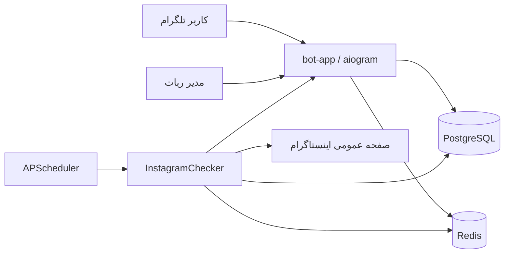

# Farstar Warner | فارستار وارنر

ربات تلگرام فارسی برای پایش وضعیت پیج‌های عمومی اینستاگرام، بدون دریافت رمز عبور کاربر یا نیاز به کلید رسمی API اینستاگرام.

[راهنمای فارسی](#راهنمای-فارسی) · [English guide](#english-guide)

---

## راهنمای فارسی

### معرفی پروژه

فارستار وارنر یک سامانه ناهمگام برای پایش پیج‌های عمومی اینستاگرام است. کاربران می‌توانند پیج‌های موردنظرشان را به ربات اضافه کنند و برای فعال‌شدن، دی‌اکتیوشدن یا تغییر نام کاربری آن‌ها اعلان بگیرند. تمام پیام‌ها، دکمه‌ها، هشدارها و منوهای ربات به زبان فارسی هستند.

این سامانه فقط اطلاعات عمومی را بررسی می‌کند و هیچ رمز عبور، کوکی حساب شخصی یا دسترسی رسمی اینستاگرام از کاربر دریافت نمی‌کند.

### امکانات

- رابط کاربری کاملاً فارسی با `aiogram 3`
- پایش ناهمگام پیج‌های عمومی با `HTTPX`
- تشخیص تغییر وضعیت فعال و دی‌اکتیو
- تنظیم جداگانه اعلان‌ها برای هر پیج
- پلن رایگان با ۱ پیج، پریمیوم با ۱۰ پیج و ویژه با ۵۰ پیج
- پنل مدیریت برای مشاهده آمار، تمدید اشتراک و تغییر فاصله بررسی‌ها
- PostgreSQL برای نگهداری کاربران، پیج‌ها و تنظیمات
- Redis برای وضعیت‌های موقت ربات، قفل توزیع‌شده و کنترل محدودیت درخواست
- زمان‌بندی بررسی‌ها با APScheduler
- تأخیر تصادفی، User-Agent چرخشی، هم‌روندی محدود و توقف خودکار هنگام دریافت خطای `429`
- اجرای ایمن در کانتینر بدون دسترسی ریشه، با فایل‌سیستم فقط‌خواندنی
- نصب تعاملی روی اوبونتو با یک اسکریپت انگلیسی

### معماری



سه سرویس Docker Compose اجرا می‌شوند:

- `bot-app`: ربات تلگرام و چکر ناهمگام
- `postgres`: پایگاه داده دائمی
- `redis`: ذخیره وضعیت FSM، قفل اجرای چکر و زمان توقف پس از محدودیت درخواست

### پیش‌نیازها

- یک سرور Ubuntu با دسترسی `sudo` یا کاربر `root`
- توکن ربات از `@BotFather`
- شناسه عددی تلگرام مدیر
- دسترسی خروجی HTTPS به تلگرام، اینستاگرام و مخزن‌های Docker

در صورت نصب‌نبودن Docker و Docker Compose، اسکریپت نصب آن‌ها را از مخزن رسمی Docker دریافت می‌کند.

### نصب سریع روی اوبونتو

```bash
git clone https://github.com/farstar-team/farstar-warner.git
cd farstar-warner
chmod +x install.sh
./install.sh
```

نصب‌کننده موارد زیر را به زبان انگلیسی درخواست می‌کند:

1. توکن ربات تلگرام
2. شناسه عددی مدیر
3. نام پایگاه داده PostgreSQL
4. نام کاربری PostgreSQL
5. رمز PostgreSQL
6. رمز Redis؛ با خالی‌گذاشتن این مقدار یک رمز امن ساخته می‌شود

سپس فایل `.env` با سطح دسترسی محدود ساخته شده و دستور زیر خودکار اجرا می‌شود:

```bash
docker compose up --build -d
```

### بررسی وضعیت اجرا

```bash
docker compose ps
docker compose logs -f bot-app
```

برای خروج از نمایش زنده لاگ‌ها، کلیدهای `Ctrl+C` را فشار دهید. این کار سرویس ربات را متوقف نمی‌کند.

دستورهای مدیریتی متداول:

```bash
# راه‌اندازی مجدد ربات
docker compose restart bot-app

# توقف همه سرویس‌ها بدون حذف داده‌ها
docker compose down

# اجرای دوباره سرویس‌ها
docker compose up -d

# دریافت کد جدید و بازسازی برنامه
git pull
docker compose up --build -d
```

برای جلوگیری از حذف اطلاعات، از `docker compose down -v` استفاده نکنید؛ گزینه `-v` داده‌های PostgreSQL و Redis را پاک می‌کند.

### استفاده از ربات

پس از نصب، وارد گفت‌وگوی ربات شوید و دستور `/start` را ارسال کنید.

منوی اصلی شامل این گزینه‌هاست:

- `مدیریت پیج‌ها 📊`: افزودن، مشاهده یا حذف پیج
- `خرید اشتراک 💎`: ارسال درخواست پلن پریمیوم یا ویژه برای مدیر
- `تنظیمات اعلان‌ها ⚙️`: فعال یا غیرفعال‌کردن اعلان هر پیج
- `حساب کاربری 👤`: مشاهده پلن، اعتبار و تعداد پیج‌ها

نام کاربری اینستاگرام را می‌توان به یکی از شکل‌های زیر فرستاد:

```text
@instagram
instagram
https://www.instagram.com/instagram/
```

### پنل مدیریت

مدیری که شناسه او در `ADMIN_TELEGRAM_ID` ثبت شده است می‌تواند دستور زیر را اجرا کند:

```text
/admin
```

امکانات پنل مدیریت:

- مشاهده تعداد کاربران و وضعیت پیج‌ها
- تمدید اشتراک کاربر و انتخاب پلن جدید
- تغییر فاصله بررسی چکر بین ۳۰ تا ۸۶۴۰۰ ثانیه

فاصله جدید در Redis ذخیره می‌شود و پس از راه‌اندازی مجدد نیز باقی می‌ماند.

### منطق پایش

چکر برای هر پیج عمومی یک درخواست HTTPS ارسال می‌کند:

- انتقال وضعیت از دی‌اکتیو به فعال، اعلان `پیج فعال شد! 🎉` ایجاد می‌کند.
- انتقال وضعیت از فعال به دی‌اکتیو، اعلان `پیج دی‌اکتیو شد! ⚠️` ایجاد می‌کند.
- اولین بررسی فقط وضعیت پایه را ثبت می‌کند و اعلان تغییر وضعیت نمی‌فرستد.
- پاسخ‌های ورود اجباری، چالش امنیتی، خطاهای شبکه و خطاهای موقت به‌عنوان وضعیت نامشخص در نظر گرفته می‌شوند و وضعیت ذخیره‌شده را تغییر نمی‌دهند.
- در پاسخ `429` همه بررسی‌ها برای مدت مشخصی متوقف می‌شوند تا فشار بیشتری به سرویس وارد نشود.

> [!IMPORTANT]
> اینستاگرام می‌تواند ساختار صفحات عمومی یا سیاست‌های دسترسی خود را بدون اطلاع قبلی تغییر دهد. پایش بدون API رسمی تضمین دائمی ندارد. فقط پیج‌های عمومی را بررسی کنید و قوانین محل فعالیت و شرایط استفاده سرویس‌ها را رعایت کنید.

### متغیرهای محیطی

اسکریپت نصب متغیرهای ضروری را در `.env` می‌سازد. این فایل در Git نادیده گرفته شده و نباید در مخزن ثبت شود.

| متغیر | الزامی | مقدار پیش‌فرض | توضیح |
|---|---:|---:|---|
| `TELEGRAM_BOT_TOKEN` | بله | — | توکن دریافتی از BotFather |
| `ADMIN_TELEGRAM_ID` | بله | — | شناسه عددی مدیر |
| `POSTGRES_DB` | بله | `farstar_warner` | نام پایگاه داده |
| `POSTGRES_USER` | بله | `farstar` | کاربر PostgreSQL |
| `POSTGRES_PASSWORD` | بله | — | رمز PostgreSQL |
| `POSTGRES_HOST` | خیر | `postgres` | نام میزبان پایگاه داده |
| `POSTGRES_PORT` | خیر | `5432` | پورت PostgreSQL |
| `DATABASE_POOL_SIZE` | خیر | `10` | اندازه پایه مخزن اتصال |
| `DATABASE_MAX_OVERFLOW` | خیر | `20` | اتصال‌های اضافه مجاز |
| `REDIS_HOST` | خیر | `redis` | نام میزبان Redis |
| `REDIS_PORT` | خیر | `6379` | پورت Redis |
| `REDIS_DB` | خیر | `0` | شماره دیتابیس Redis |
| `REDIS_PASSWORD` | بله | — | رمز Redis |
| `CHECK_INTERVAL_SECONDS` | خیر | `300` | فاصله اولیه بررسی‌ها؛ حداقل ۳۰ ثانیه |
| `CHECK_CONCURRENCY` | خیر | `8` | تعداد بررسی هم‌زمان؛ بین ۱ تا ۵۰ |
| `CHECK_JITTER_MIN_SECONDS` | خیر | `0.5` | کمترین تأخیر تصادفی |
| `CHECK_JITTER_MAX_SECONDS` | خیر | `3.0` | بیشترین تأخیر تصادفی |
| `INSTAGRAM_BASE_URL` | خیر | `https://www.instagram.com` | نشانی پایه صفحات عمومی |
| `INSTAGRAM_REQUEST_TIMEOUT_SECONDS` | خیر | `20` | مهلت هر درخواست HTTP |
| `RATE_LIMIT_COOLDOWN_SECONDS` | خیر | `900` | توقف پیش‌فرض پس از محدودیت درخواست |
| `FREE_TRIAL_DAYS` | خیر | `7` | اعتبار اولیه کاربر جدید |
| `LOG_LEVEL` | خیر | `INFO` | سطح ثبت رویدادها |

بعد از تغییر دستی `.env`، برنامه را بازسازی و اجرا کنید:

```bash
docker compose up --build -d
```

اگر فاصله بررسی قبلاً از پنل مدیریت تغییر کرده باشد، مقدار ذخیره‌شده در Redis بر `CHECK_INTERVAL_SECONDS` اولویت دارد. برای تغییر آن دوباره از گزینه زمان‌بندی در پنل مدیریت استفاده کنید.

### پشتیبان‌گیری از پایگاه داده

ساخت نسخه پشتیبان:

```bash
docker compose exec -T postgres sh -c 'pg_dump -U "$POSTGRES_USER" "$POSTGRES_DB"' > farstar-backup.sql
```

بازیابی نسخه پشتیبان در پایگاه داده موجود:

```bash
docker compose exec -T postgres sh -c 'psql -U "$POSTGRES_USER" "$POSTGRES_DB"' < farstar-backup.sql
```

پیش از بازیابی، از وضعیت فعلی نسخه پشتیبان بگیرید؛ بازیابی می‌تواند اطلاعات موجود را تغییر دهد.

### عیب‌یابی

مشاهده صد خط آخر لاگ ربات:

```bash
docker compose logs --tail=100 bot-app
```

اگر ربات پاسخ نمی‌دهد:

1. با `docker compose ps` سالم‌بودن هر سه سرویس را بررسی کنید.
2. توکن و شناسه مدیر را در `.env` کنترل کنید.
3. خروجی `docker compose logs --tail=100 bot-app` را بررسی کنید.
4. مطمئن شوید سرور به `api.telegram.org` دسترسی دارد.

اگر بررسی اینستاگرام موقتاً انجام نمی‌شود، وجود خطای `429` یا پیام cooldown در لاگ طبیعی است؛ پس از پایان زمان توقف، چکر خودکار ادامه می‌دهد.

### ساختار پروژه

```text
farstar-warner/
├── install.sh
├── docker-compose.yml
├── Dockerfile
├── requirements.txt
└── bot/
    ├── config.py
    ├── database.py
    ├── models.py
    ├── checker.py
    ├── main.py
    ├── handlers/
    │   ├── admin.py
    │   └── user.py
    └── keyboards/
        ├── inline.py
        └── reply.py
```

---

## English guide

Farstar Warner is an asynchronous Telegram bot for monitoring public Instagram profiles without collecting Instagram passwords or requiring official Instagram API credentials. The Telegram interface is entirely in Persian; the Ubuntu installer is in English.

### Main features

- Asynchronous Telegram UI with aiogram 3
- Public-profile checks with HTTPX
- Activation, deactivation, and username-change notifications
- Per-profile notification settings
- Free, Premium, and VIP target limits
- Restricted administrator panel
- PostgreSQL persistence and Redis coordination
- APScheduler background checks with jitter, bounded concurrency, distributed locking, and HTTP 429 cooldown
- Hardened, non-root Docker deployment

### Ubuntu installation

Requirements: an Ubuntu server with root or sudo access, a Telegram bot token, and the numeric Telegram ID of the administrator.

```bash
git clone https://github.com/farstar-team/farstar-warner.git
cd farstar-warner
chmod +x install.sh
./install.sh
```

The installer checks Docker and the Docker Compose plugin, installs them when missing, prompts for application and database credentials, creates `.env`, and starts all services.

Check the deployment:

```bash
docker compose ps
docker compose logs -f bot-app
```

Update and rebuild:

```bash
git pull
docker compose up --build -d
```

Open the bot and send `/start`. The configured administrator can access the restricted panel with `/admin`.

### Operational note

Instagram can change public page behavior or apply temporary access restrictions at any time. Login redirects, challenge pages, network errors, and temporary server failures are treated as unknown results and do not overwrite the last known profile state. A `429` response activates a shared Redis cooldown.

Use the software only for public profiles and in accordance with applicable law and platform terms.
