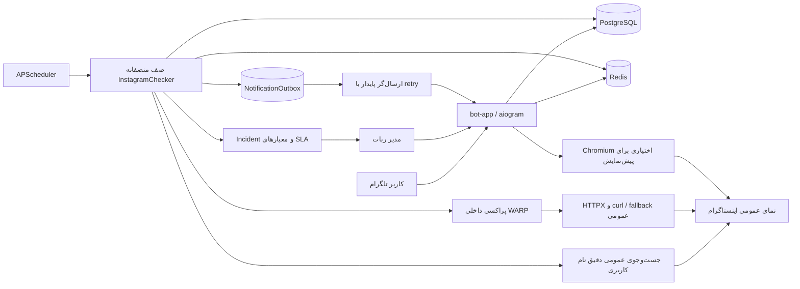

# Farstar Warner | فارستار وارنر

ربات تلگرام فارسی برای پایش OSINT ویژگی‌های عمومی پیج‌های اینستاگرام؛ بدون دریافت یا ذخیره رمز عبور، کوکی، sessionid یا توکن Meta.

[راهنمای فارسی](#راهنمای-فارسی) · [English guide](#english-guide)

---

## راهنمای فارسی

### معرفی پروژه

فارستار وارنر یک سامانه ناهمگام برای پایش پیج‌های عمومی اینستاگرام است. کاربران می‌توانند پیج‌های موردنظرشان را به ربات اضافه کنند و برای فعال‌شدن، دی‌اکتیوشدن یا تغییر نام کاربری آن‌ها اعلان بگیرند. تمام پیام‌ها، دکمه‌ها، هشدارها و منوهای ربات به زبان فارسی هستند.

نسخه **۵.۳.۰** کاملاً OSINT-only است و فقط داده‌هایی را تحلیل می‌کند که در Web Profile، Embed، جست‌وجوی مهمان یا HTML عمومی دیده می‌شوند. ربات هیچ رمز عبور، کوکی، `sessionid` یا توکن Meta دریافت نمی‌کند و برای پایش نیز به سرویس پولی متکی نیست.

### چه چیزی در نسخه ۵.۳.۰ اصلاح شد؟

گزارش‌نشدن فعال‌شدن بعضی پیج‌ها فقط یک خطای HTTP نبود؛ سه اشکال معماری هم‌زمان باعث آن می‌شدند:

- پس از اولین محدودیت سراسری، workerها بقیه صف را بدون انجام درخواست واقعی کنار می‌گذاشتند و ترتیب ثابت شناسه‌ها باعث می‌شد بعضی پیج‌های غیرفعال چند چرخه پشت صف بمانند.
- مدار محافظ با پاسخ‌های تکراری دوباره تمدید می‌شد و مانیتور سلامت نیز هم‌زمان با چکر درخواست جداگانه می‌فرستاد؛ در نتیجه اختلال کوتاه می‌توانست به توقف طولانی و پیام‌های تکراری مدیر تبدیل شود.
- اعلان تغییر وضعیت مستقیماً پس از commit به تلگرام فرستاده می‌شد؛ بنابراین restart، خطای موقت Telegram یا قطع شبکه می‌توانست اعلان ثبت‌شده را از بین ببرد.

نسخه ۵.۳.۰ صف را بر اساس «غیرفعال‌ها اول، سپس قدیمی‌ترین بررسی» منصفانه مرتب می‌کند، نتیجه یک username مشترک را در همان چرخه میان کاربران به اشتراک می‌گذارد و هنگام اختلال baseline یک مسیر **بازیابی فقط-مثبت** اجرا می‌کند. این مسیر فقط شاهد فعال‌شدن را می‌پذیرد و هرگز از پاسخ نامشخص، وضعیت منفی نمی‌سازد. تغییر وضعیت و رکورد `NotificationOutbox` نیز در یک تراکنش ذخیره می‌شوند؛ dispatcher جداگانه هر پنج ثانیه اعلان‌های معوق را با backoff دوباره می‌فرستد، پس restart بین تشخیص و ارسال باعث گم‌شدن اعلان نمی‌شود.


### امکانات

- رابط کاربری کاملاً فارسی با `aiogram 3`
- موتور اجماع Web Profile، جست‌وجوی مهمان، Embed و رندر عمومی Playwright
- رادار جهش غیرعادی فالوور، تغییر لینک بیو و تبدیل حساب حرفه‌ای به شخصی
- خط زمانی جرم‌شناسی دیجیتال با ۳۰ ارزیابی اخیر هر پیج
- تشخیص تغییر وضعیت فعال و دی‌اکتیو
- تنظیم جداگانه اعلان‌ها برای هر پیج
- نمایش زنده عکس پروفایل، تعداد دنبال‌کننده، پست‌ها و عمومی یا خصوصی‌بودن پیج
- نمایش بیوگرافی پیج عمومی در صورتی که نمای embed آن را ارائه کند
- ساخت کارت تصویری انگلیسی با طراحی شیشه‌ای هنگام ثبت پیج برای تأیید نام، عکس، آمار و بیوگرافی قابل‌دسترسی
- امکان ثبت نام کاربری غیرفعال برای کاربرانی که منتظر فعال‌شدن آن هستند
- پلن رایگان دائمی با ۱ پیج، Premium با ظرفیت پایه ۱۰۰ پیج و VIP با ظرفیت پایه ۵۰۰ پیج
- پلن‌های مدت‌دار قابل افزودن، ویرایش و حذف با نام، قیمت، تعداد روز و ظرفیت دلخواه مدیر
- قیمت‌گذاری پلن و محصول با تومان یا دلار و تبدیل زنده دلار آزاد بدون API پولی
- پرداخت آنلاین زرین‌پال با Authority یکتا، تأیید دستی و تمدید idempotent اشتراک
- عضویت اجباری در یک یا چند کانال قابل‌مدیریت از پنل مدیر
- پرداخت از طریق آیدی پشتیبانی یا کارت‌به‌کارت با فیش یکتا و تأیید یا رد دستی مدیر
- تشخیص و اعلان تغییر عکس پروفایل با fingerprint پایدار مسیر تصویر
- تشخیص دریافت یا حذف تیک آبی و تنظیم مستقل اعلان آن برای هر پیج
- قیمت‌گذاری محصولات فروشگاه با واحد انتخابی تومان یا دلار
- انتخاب مستقل نوع رونوشت گزارش‌های هر کاربر برای مدیر، بدون اطلاع کاربر
- پرونده مدیریتی کاربران شامل حساب، اشتراک، خریدها، فیش‌ها و پیج‌های ثبت‌شده
- کنترل اشتراک از پرونده کاربر: تغییر پلن، افزودن ۳۰/۹۰ روز و پایان اشتراک ویژه
- ماشین وضعیت قطعی با ثبت آخرین تلاش، آخرین پاسخ معتبر و تأییدهای متوالی
- شناسایی خودکار مدیر اصلی با پلن ویژه، منوی اختصاصی و اعتبار مدیریتی
- پنل مدیریت برای افزودن پیج هدف مدیر، مشاهده سلامت تفکیک‌شده اتصال عمومی، آمار، تمدید اشتراک، تغییر فاصله و اجرای بررسی فوری
- مرکز امنیت هر پیج با ۱۰ ابزار: بررسی فوری، امتیاز هشدار، ممیزی عمومی، اثرانگشت هویت، خط مبنا، تاریخچه رخداد، گزارش حادثه، تست اعلان، سلامت پایش و تصویر شواهد
- PostgreSQL برای نگهداری کاربران، پیج‌ها و تنظیمات
- Redis برای وضعیت‌های موقت ربات، قفل توزیع‌شده و کنترل محدودیت درخواست
- زمان‌بندی بررسی‌ها با APScheduler
- صف منصفانه با اولویت پیج‌های غیرفعال، اشتراک نتیجه نام کاربری تکراری و `queue.join()` بدون sentinel
- مدار محافظ واقعی با cache، single-flight، cooldown محدود و مسیر مستقل بازیابی فعال‌شدن
- صندوق اعلان تراکنشی و پایدار با retry، backoff و کلید یکتای رخداد
- مرکز عملیات مدیر برای SLA، backlog، نتیجه چرخه، incident زیرساخت و وضعیت تحویل اعلان‌ها
- خط زمانی کاربر با ۳۰ شاهد قطعی، درصد دسترس‌پذیری، رشد فالوور و سلامت SLA هر پیج
- رخداد سلامت مدیر با یک پیام آغاز، حداکثر یک یادآوری در شش ساعت و یک پیام بازیابی؛ همراه سکوت موقت قابل‌کنترل
- نگهداری ۲۰۰۰ رخداد عیب‌یابی و حذف تکرار رخدادهای پرنویز در پنجره تطبیقی ۱ تا ۱۵ دقیقه‌ای
- تأخیر کوتاه کنترل‌شده، هم‌روندی محدود و circuit breaker برای پاسخ‌های `401`، `403` و `429`
- اجرای ایمن در کانتینر بدون دسترسی ریشه، با فایل‌سیستم فقط‌خواندنی
- نصب تعاملی روی اوبونتو با یک اسکریپت انگلیسی
- پنل مدیریت انگلیسی سرور با فرمان `farstar` و پشتیبانی از چند ربات مستقل
- نسخه‌گذاری معنایی، فرمان `/version` و اعلان خودکار فارسی به مدیر پس از فعال‌شدن هر نسخه جدید
- نمایش پایدار اطلاعات پیج با کش آخرین پاسخ سالم، تک‌درخواستی و کنترل نرخ سراسری اینستاگرام
- تمدید تجمیعی اشتراک؛ مدت خرید جدید به تاریخ پایان فعلی اضافه می‌شود
- یادآوری روزانه در سه روز پایانی اشتراک با امکان قطع یا فعال‌کردن اعلان توسط کاربر
- کد تخفیف دارای درصد، سقف مصرف و تاریخ انقضا با کنترل نهایی هنگام تأیید فیش
- فروشگاه محصولات با افزودن/حذف محصول و کلید خاموش/روشن از پنل مدیر

### معماری



چهار سرویس Docker Compose اجرا می‌شوند:

- `bot-app`: ربات تلگرام و چکر ناهمگام
- `postgres`: پایگاه داده دائمی
- `redis`: ذخیره وضعیت FSM، قفل اجرای چکر، مدار محافظ، incident، معیار چرخه و cacheهای کوتاه‌عمر
- `warp_proxy`: مسیر خروجی SOCKS5 داخلی با health-check مستقل و داده ثبت پایدار

### پیش‌نیازها

- یک سرور Ubuntu با دسترسی `sudo` یا کاربر `root`
- توکن ربات از `@BotFather`
- شناسه عددی تلگرام مدیر
- دسترسی خروجی HTTPS به تلگرام، اینستاگرام و مخزن‌های Docker

در صورت نصب‌نبودن Docker و Docker Compose، اسکریپت نصب آن‌ها را از مخزن رسمی Docker دریافت می‌کند.

### نصب سریع روی اوبونتو

```bash
git clone https://github.com/farstar-team/farstar-warner.git
cd farstar-warner
chmod +x install.sh
./install.sh
```

نصب‌کننده موارد زیر را به زبان انگلیسی درخواست می‌کند:

1. توکن ربات تلگرام
2. شناسه عددی مدیر
3. نام پایگاه داده PostgreSQL
4. نام کاربری PostgreSQL
5. رمز PostgreSQL
6. رمز Redis؛ با خالی‌گذاشتن این مقدار یک رمز امن ساخته می‌شود

توکن تلگرام هنگام تایپ نمایش داده می‌شود تا بتوانید درستی آن را کنترل کنید؛ رمزهای PostgreSQL و Redis برای امنیت مخفی می‌مانند.

سپس فایل `.env` با سطح دسترسی محدود ساخته شده و دستور زیر خودکار اجرا می‌شود:

```bash
docker compose up --build -d
```

در پایان نصب، فرمان سراسری `farstar` نیز روی سرور فعال می‌شود.

### فعال‌کردن پنل سرور روی نصب قبلی

اگر نسخه قبلی ربات از قبل نصب است، bootstrap مدیر سرور را یک‌بار اجرا کنید. این روش روی تغییرات محلی متوقف نمی‌شود و پیش از همگام‌سازی backup می‌گیرد:

```bash
curl -fsSL https://raw.githubusercontent.com/farstar-team/farstar-warner/main/update.sh | sudo bash
```

این فرمان تنظیمات و دیتابیس نمونه‌های موجود را نگه می‌دارد، مدیر فعلی `farstar` را نصب و آخرین نسخه را بازسازی می‌کند. پس از آن پنل با فرمان زیر باز می‌شود:

```bash
farstar
```

### پنل مدیریت سرور با فرمان farstar

فرمان `farstar` یک منوی انگلیسی برای عملیات روزمره سرور باز می‌کند:

- افزودن و نصب ربات جدید با PostgreSQL و Redis مستقل
- فهرست‌کردن همه ربات‌ها و وضعیت اجرای آن‌ها
- شروع، توقف و راه‌اندازی مجدد هر ربات
- مشاهده زنده لاگ هر نمونه
- دریافت آخرین نسخه شاخه `main` از GitHub و بازسازی ربات‌های در حال اجرا
- ویرایش تنظیمات هر ربات
- پشتیبان‌گیری و بازیابی PostgreSQL
- حذف امن ربات با امکان نگه‌داشتن یا پاک‌کردن داده‌ها
- مشاهده نسخه Docker و مصرف منابع کانتینرها

فرمان‌های مستقیم نیز در دسترس هستند:

```bash
farstar list
farstar status warner
farstar logs warner
farstar apply warner
farstar update
farstar backup warner
farstar doctor
farstar version
farstar help
```

از آپدیت‌های بعدی فقط `farstar update` لازم است. اگر فرمان نصب‌شده بسیار قدیمی است، bootstrap بخش قبل را دوباره اجرا کنید.

ربات اولیه با نام `warner` ثبت می‌شود. هر ربات جدید نام نمونه، توکن، مدیر، پایگاه داده، Redis، شبکه و volumeهای جداگانه دارد.

برای نصب ربات جدید:

```bash
farstar add
```

برای حذف یک ربات:

```bash
farstar remove NAME
```

حذف volumeها اختیاری است. اگر در پاسخ حذف داده‌ها `y` وارد کنید، اطلاعات PostgreSQL و Redis آن نمونه نیز پاک می‌شود.

### بررسی وضعیت اجرا

```bash
farstar status warner
farstar logs warner
```

برای خروج از نمایش زنده لاگ‌ها، کلیدهای `Ctrl+C` را فشار دهید. این کار سرویس ربات را متوقف نمی‌کند.

دستورهای مدیریتی متداول:

```bash
# راه‌اندازی مجدد ربات
farstar restart warner

# توقف همه سرویس‌ها بدون حذف داده‌ها
farstar stop warner

# اجرای دوباره سرویس‌ها
farstar start warner

# دریافت کد جدید و بازسازی برنامه
farstar update
```

از نسخه ۵.۲.۱ به بعد همین یک فرمان پیش از تغییر سورس از تمام دیتابیس‌های در حال اجرا backup می‌گیرد، تغییرات محلی را در stash و یک شاخه پشتیبان نگه می‌دارد، سورس را دقیقاً با `origin/main` همگام می‌کند، image جدید می‌سازد و ربات‌های فعال را دوباره ایجاد می‌کند. بنابراین وجود تغییرات tracked روی سرور دیگر باعث توقف آپدیت نمی‌شود.

برای نصب مستقیم نسخه ۵.۳.۰ روی نصب موجود نیز همین فرمان کافی است:

```bash
farstar update
```

اگر سرور هنوز نسخه قدیمی فرمان `farstar` را دارد و update روی تغییرات محلی متوقف می‌شود، bootstrap امن بخش «فعال‌کردن پنل سرور روی نصب قبلی» را یک‌بار اجرا کنید.

در خروجی update، مسیر backup دیتابیس و مسیر پشتیبان سورس را یادداشت کنید. فایل‌های SQL در `/var/backups/farstar-warner/INSTANCE/` و اطلاعات سورس قبلی در `/var/backups/farstar-warner/source-TIMESTAMP/` نگهداری می‌شوند؛ commit قبلی نیز با شاخه‌ای به‌شکل `farstar-server-backup-TIMESTAMP` باقی می‌ماند. بازیابی دیتابیس با `farstar restore INSTANCE` انجام می‌شود. بازگشت سورس را فقط پس از انتخاب همان شاخه پشتیبان و همراه بازسازی image انجام دهید؛ restore دیتابیس می‌تواند داده فعلی را بازنویسی کند، پس ابتدا از وضعیت فعلی backup بگیرید.

برای حذف ربات از `farstar remove` استفاده کنید. مدیر سرور قبل از حذف volumeهای PostgreSQL و Redis تأیید جداگانه می‌گیرد.

### استفاده از ربات

پس از نصب، وارد گفت‌وگوی ربات شوید و دستور `/start` را ارسال کنید.

نسخه فعال در پیام شروع و فرمان `/version` نمایش داده می‌شود. نسخه فعلی **5.3.0** است. پس از اولین اجرای موفق هر نسخه جدید، مدیر اصلی یک اعلان فارسی شامل شماره نسخه و فهرست تغییرات دریافت می‌کند. آخرین نسخه‌ای که اعلان شده در Redis نگهداری می‌شود تا با هر restart پیام تکراری ارسال نشود.

منوی اصلی شامل این گزینه‌هاست:

- `مدیریت پیج‌ها 📊`: افزودن، مشاهده یا حذف پیج
- `خرید اشتراک 💎`: مشاهده پلن‌های فعال، ارتباط با پشتیبانی یا ارسال فیش کارت‌به‌کارت
- `تنظیمات اعلان‌ها ⚙️`: فعال یا غیرفعال‌کردن اعلان هر پیج
- `حساب کاربری 👤`: مشاهده پلن، اعتبار و تعداد پیج‌ها
- `پنل مدیریت 🛡️`: فقط برای مدیر اصلی نمایش داده می‌شود

نام کاربری اینستاگرام را می‌توان به یکی از شکل‌های زیر فرستاد:

```text
@instagram
instagram
https://www.instagram.com/instagram/
```

پس از انتخاب هر پیج، دکمه `مشاهده اطلاعات زنده پیج 🔎` در دسترس است. ربات در صورت دسترسی، عکس پروفایل، تعداد دنبال‌کننده، پست، عمومی یا خصوصی‌بودن، وضعیت تأیید و اطلاعات تکمیلی پیج عمومی را ارسال می‌کند.

از دکمه `مرکز امنیت و شواهد پیج` نیز می‌توان ۱۰ ابزار دفاعی و گزارش‌گیری را اجرا کرد. خط مبنای هویت در Redis ذخیره می‌شود و اثر فعلی نام، بیوگرافی، تصویر، نوع پیج و نشان تأیید را با آن مقایسه می‌کند.

در نسخه ۵.۳.۰ دو نمای عملیاتی نیز برای هر کاربر وجود دارد:

- `خط زمانی و آپ‌تایم`: حداکثر ۳۰ شاهد قطعی اخیر، درصد دسترس‌پذیری بر اساس همان شواهد، رشد فالوور و منبع هر نتیجه را نشان می‌دهد. پاسخ نامشخص در محاسبه آپ‌تایم «غیرفعال» محسوب نمی‌شود.
- `سلامت پایش`: زمان آخرین تلاش و آخرین پاسخ قطعی، تعداد پاسخ‌های نامشخص متوالی، فاصله زمان‌بندی، وضعیت SLA، مدار محافظ و تعداد اعلان‌های در انتظار یا ناموفق همان پیج را نمایش می‌دهد.

هنگام افزودن یا بررسی پیج، ربات Web Profile عمومی را اجرا می‌کند و اگر پاسخ آن ناقص یا نامعتبر باشد، جست‌وجوی مستقل مهمان، Embed و Playwright عمومی به‌ترتیب به‌عنوان شاهدهای کمکی اجرا می‌شوند:

- اگر پیج فعال باشد، نام، بیوگرافی، تصویر، دنبال‌کننده، دنبال‌شونده، تعداد پست، نوع پیج و نشان تأیید مستقیماً از JSON استخراج می‌شود. ربات اطلاعات فارسی و کارت تصویری اختصاصی را برای تأیید می‌فرستد؛ شکست ساخت یا ارسال عکس مانع نمایش متن و دکمه تأیید نمی‌شود.
- اگر پاسخ `404` باشد، گزینه «ثبت به‌عنوان پیج غیرفعال» نمایش داده می‌شود. این پیج با وضعیت غیرفعال ذخیره می‌شود و به‌محض بازگشت پاسخ `200`، اعلان فعال‌شدن ارسال خواهد شد.
- در پاسخ نامشخص، redirect، محدودیت موقت یا خطای شبکه، کاربر می‌تواند پیج را فعال ثبت کند یا گزینه «فعلاً غیرفعال است» را برای انتظار فعال‌شدن انتخاب کند. نتیجه نامشخص خودکار وضعیت رکوردهای قبلی را تغییر نمی‌دهد.

### پنل مدیریت

مدیری که شناسه او در `ADMIN_TELEGRAM_ID` ثبت شده است می‌تواند دستور زیر را اجرا کند:

```text
/admin
```

امکانات پنل مدیریت:

- مشاهده تعداد کاربران و وضعیت پیج‌ها
- تمدید اشتراک کاربر و انتخاب پلن جدید
- افزودن، ویرایش و حذف پلن‌های مدت‌دار همراه قیمت و ظرفیت
- مدیریت کانال‌های عضویت اجباری
- تغییر آیدی پشتیبانی، شماره کارت و نام صاحب کارت
- ثبت شناسه پذیرنده، آدرس بازگشت و روشن/خاموش‌کردن زرین‌پال از داخل پنل
- تنظیم نرخ پشتیبان دلار و آزمایش فوری نرخ زنده از داخل پنل
- مشاهده فیش‌های در انتظار و تأیید یا رد آن‌ها زیر همان تصویر
- تغییر فاصله بررسی چکر بین ۳۰ تا ۸۶۴۰۰ ثانیه
- قراردادن بررسی فوری همه پیج‌ها در صف اجرا
- افزودن پیج به حساب پایش مدیر با همان جریان تأیید تصویری کاربران
- انتخاب جداگانه رونوشت فعال‌شدن، دی‌اکتیوشدن، تیک آبی، فالوور، محتوا، پروفایل و هویت برای هر کاربر
- مدیریت کاربران همراه جست‌وجوی شناسه، مشاهده اشتراک، خریدها، فیش‌ها، پیج‌ها و مسدودسازی حساب
- کنترل مستقیم اشتراک هر کاربر، شامل تغییر پلن و روزها، تمدید سریع و بازگرداندن به پلن رایگان
- مشاهده وضعیت Chromium، endpoint عمومی، cooldown و حالت ورود/عدم ورود
- «مرکز عملیات پایش» با وضعیت incident، مدار محافظ، تعداد کل و یکتای هدف‌ها، پیج‌های منتظر فعال‌شدن، backlog عقب‌افتاده از SLA و پاسخ‌های نامشخص
- مشاهده آمار چرخه واقعی شامل تعداد برنامه‌ریزی‌شده، بررسی‌شده، تعویق‌خورده، خطا و مدت اجرا
- مشاهده وضعیت صندوق اعلان شامل `Pending`، `Retry`، `Dead` و `Sent` و تلاش دوباره دستی اعلان‌های تحویل‌نشده
- اجرای فوری مسیر بازیابی پیج‌های غیرفعال، آزمون شاهد مرجع و سکوت شش‌ساعته هشدار زیرساخت
- مشاهده مرکز لاگ فنی شامل نتیجه هر مسیر HTTPX/HTTP2 و curl، کد HTTP، زمان پاسخ، اندازه پاسخ، علت رد پاسخ و شناسه رهگیری
- دریافت فایل UTF-8 از حداکثر ۲۰۰۰ رخداد اخیر برای گزارش خطا و امکان پاک‌سازی لاگ با تأیید دوباره؛ رخدادهای عادی طی ۶۰ ثانیه و هشدارهای تکراری طی ۹۰۰ ثانیه نمونه‌برداری می‌شوند

گزارش تغییرات هر پیج به‌صورت پیش‌فرض فقط برای مالک آن ارسال می‌شود. مدیر می‌تواند از گزینه «رونوشت گزارش کاربران» برای هر شناسه، فقط نوع گزارش‌های موردنیازش را انتخاب کند. این تنظیم هیچ پیام یا نشانه‌ای برای کاربر ایجاد نمی‌کند. خطاهای تکراری دسترسی اینستاگرام برای هر هدف به مدیر ارسال نمی‌شوند؛ incident زیرساخت فقط پس از عبور از آستانه شکست باز می‌شود، در حالت پایدار حداکثر هر شش ساعت یادآوری می‌شود و پس از بازیابی یک پیام پایان حادثه دارد. جزئیات فنی در بخش «لاگ کامل و عیب‌یابی» باقی می‌مانند.

حساب مدیر اصلی هنگام شروع برنامه به‌صورت خودکار فعال، روی پلن ویژه و با منوی اختصاصی ثبت می‌شود.

فاصله جدید در Redis ذخیره می‌شود و پس از راه‌اندازی مجدد نیز باقی می‌ماند.

برای راه‌اندازی فروش اشتراک پس از نصب:

1. از «مدیریت پلن‌های اشتراک» حداقل یک پلن با نام، قیمت، روز و ظرفیت بسازید.
2. از «تنظیمات پرداخت» آیدی پشتیبانی و در صورت نیاز شماره کارت و نام صاحب کارت را ثبت کنید.
3. از «کانال‌های عضویت اجباری» کانال‌ها را اضافه کنید؛ ربات باید در هر کانال مدیر باشد تا بتواند عضویت کاربران را بررسی کند.
4. فیش‌های جدید به مدیر ارسال می‌شوند و از «فیش‌های در انتظار» نیز قابل بازیابی و بررسی هستند.

اشتراک فقط پس از انتخاب «تأیید فیش و فعال‌سازی» توسط مدیر فعال می‌شود. شناسه یکتای فایل تلگرام در دیتابیس ذخیره می‌شود تا همان فیش دوباره ثبت نشود.

### منطق پایش

پیش از هر چرخه، پیج‌های مرجع تنظیم‌شده از مسیرهای عمومی بررسی می‌شوند. اگر شاهد فعال معتبر دریافت شود، چرخه کامل اجرا می‌شود. اگر baseline ناموفق باشد، تغییر منفی همه پیج‌ها متوقف می‌شود اما مسیر بازیابی فقط-مثبت، بخشی از پیج‌های ثبت‌شده با وضعیت غیرفعال را مستقل از cooldown بررسی می‌کند. بنابراین اختلال عمومی نمی‌تواند اعلان دی‌اکتیو اشتباه بسازد و در عین حال فرصت تشخیص فعال‌شدن از بین نمی‌رود.

در چرخه کامل، پیج‌های غیرفعال پیش از بقیه و سپس هدف‌ها بر اساس قدیمی‌ترین `last_checked_at` مرتب می‌شوند. درخواست سازگار با `curl` واقعی سرور ابتدا اجرا می‌شود و مسیرهای HTTPX، جست‌وجوی عمومی دقیق، Embed و Playwright به‌عنوان شواهد مستقل ادامه می‌یابند؛ پیشنهاد username مشابه هرگز پذیرفته نمی‌شود:

- انتقال وضعیت از دی‌اکتیو به فعال، اعلان `پیج فعال شد! 🎉` ایجاد می‌کند.
- انتقال وضعیت از فعال به دی‌اکتیو پس از دو شاهد قطعی با فاصله پیش‌فرض حدود ۱۵ ثانیه، اعلان `پیج دی‌اکتیو شد! ⚠️` ایجاد می‌کند.
- پاسخ JSON سالم جست‌وجو که username دقیق را ندارد، شاهد غیرفعال/تغییرنام است؛ پاسخ 401، login wall، JSON ناقص یا خطای شبکه هرگز شاهد غیرفعال‌شدن نیست.
- منبع و زمان آخرین شاهد قطعی و آخرین شاهد غیرفعال‌شدن برای هر پیج در دیتابیس ذخیره و در جزئیات پیج نمایش داده می‌شود.
- هر پیج وضعیت قطعی، نتیجه آخرین تلاش، زمان آخرین پاسخ معتبر، کد HTTP و شمارنده تأیید فعال/غیرفعال مستقل دارد.
- وضعیت انتخاب‌شده دستی هنگام ثبت، تا زمان اولین پاسخ معتبر با برچسب «در انتظار تأیید قطعی» نمایش داده می‌شود.
- ورود به جزئیات فقط وضعیت ذخیره‌شده را بدون ساخت ترافیک اضافی نشان می‌دهد؛ دکمه «مشاهده اطلاعات زنده» یا «بررسی فوری» تست مرجع و بررسی stateful همان پیج را اجرا و نتیجه قطعی را با دیتابیس همگام می‌کند.
- تغییر مسیر پایدار عکس پروفایل اعلان `عکس پروفایل پیج تغییر کرد! 🖼️` ایجاد می‌کند؛ پارامترهای موقت CDN نادیده گرفته می‌شوند.
- تغییر مقدار `is_verified` اعلان تصویری دریافت یا حذف تیک آبی ایجاد می‌کند.
- تغییر تعداد پست، نام اصلی یا بیوگرافی بلافاصله فقط به مالک پیج اطلاع داده می‌شود؛ گزارش فالوور مطابق حالت انتخابی کاربر عمل می‌کند.
- گزارش فالوور برای هر پیج مستقل است: کاربر می‌تواند آن را خاموش کند، حالت آستانه‌ای با عدد دلخواه انتخاب کند یا گزارش مقایسه‌ای ساعتی بگیرد.
- تمام رخدادهای فعال‌شدن، دی‌اکتیوشدن، فالوور، پست، نام، بیو و تصویر پروفایل همراه کارت تصویری مشکی‌طلایی ارسال می‌شوند.
- موتور تصویر از فونت دو‌زبانه و RAQM/fallback استاندارد استفاده می‌کند تا فارسی راست‌به‌چپ و متن لاتین بدون مربع نمایش داده شوند.
- اولین بررسی وضعیت پایه را ثبت می‌کند؛ اما پیجی که کاربر صریحاً با وضعیت غیرفعال ذخیره کرده است، پس از دریافت نخستین شاهد فعال معتبر انتقال واقعی «غیرفعال ← فعال» و اعلان فعال‌شدن خواهد داشت.
- پاسخ‌های ورود اجباری، چالش امنیتی، خطاهای شبکه و خطاهای موقت به‌عنوان وضعیت نامشخص در نظر گرفته می‌شوند و وضعیت ذخیره‌شده را تغییر نمی‌دهند. HTTP Embed و Playwright فقط 404 صریح یا متن استاندارد نبودن صفحه را شاهد غیرفعال می‌دانند.
- برای پیج خصوصی، Embed می‌تواند نام و بخشی از آمار عمومی را استخراج کند؛ بیوگرافی خصوصی نه مقایسه و نه بازنویسی می‌شود. delta خصوصی فقط نام کاربری، فالوور، فالووینگ و تعداد پست را پایش می‌کند.
- هدف‌ها با workerهای محدودشده توسط `CHECK_CONCURRENCY` و `queue.join()` پردازش می‌شوند؛ sentinel وجود ندارد، محدودیت روی یک هدف باعث خروج worker نمی‌شود و همه اقلام صف یا بررسی یا با علت صریح `deferred` ثبت می‌شوند.
- اگر چند کاربر یک username یکسان را پایش کنند، نتیجه شبکه همان username در طول یک چرخه یک‌بار تولید و میان رکوردها به اشتراک گذاشته می‌شود؛ وضعیت و تنظیم اعلان هر مالک همچنان مستقل است.
- تمام تماس‌های HTTP و Playwright خارج از transaction دیتابیس انجام می‌شوند؛ session فقط برای خواندن اولیه یا commit نهایی باز می‌شود.
- نام و بیو پیش از مقایسه با `strip` و تبدیل `None`/رشته خالی نرمال می‌شوند.
- افزایش بیش از آستانه امنیتی فالوور در یک چرخه کوتاه، هشدار قرمز حمله اسپم ایجاد می‌کند.
- تغییر لینک خارجی بیو همراه مقدار قبلی/جدید و تحلیل محلی الگوهای فیشینگ، قمار و رمزارز گزارش می‌شود؛ ربات لینک را باز نمی‌کند.
- تبدیل حساب تجاری/حرفه‌ای به شخصی فوراً گزارش و قطع‌شدن نمایه از جست‌وجوی مهمان در لاگ امنیتی ثبت می‌شود.
- فقط ۳۰ ارزیابی اخیر هر پیج نگهداری می‌شود تا گزارش رشد و دسترس‌پذیری بدون رشد نامحدود دیتابیس ساخته شود.
- پاسخ `401` همراه `Please wait`، پاسخ `403` و پاسخ `429` در Web Profile ابتدا باعث اجرای مسیرهای عمومی مستقل می‌شوند. مدار محافظ تنها پس از چند رد متوالی باز می‌شود، نتیجه preflight و درخواست‌های هم‌نام single-flight هستند و همان خطا cooldown را بی‌نهایت تمدید نمی‌کند.
- اعلان تغییر وضعیت هم‌زمان با commit در `NotificationOutbox` ثبت می‌شود. ارسال‌گر مستقل هر پنج ثانیه اقلام `Pending` و `Retry` را تحویل می‌دهد، `retry_after` تلگرام را رعایت می‌کند و پس از restart ادامه می‌دهد. رکوردهای ارسال‌شده پس از ۳۰ روز پاک‌سازی می‌شوند.
- مانیتور پنج‌دقیقه‌ای از نتیجه مشترک preflight استفاده می‌کند و با چکر موج درخواست جداگانه نمی‌سازد. baseline نخست بهتر است یک پیج عمومی، پایدار و کم‌ترافیک متعلق به مدیر باشد.

سلامت WARP فقط با Cloudflare Trace و مقدار `warp=on` سنجیده می‌شود و دیگر پاسخ 401 اینستاگرام به‌اشتباه «خرابی WARP» گزارش نمی‌شود. `warp-supervisor.sh` هنگام سه شکست واقعی Trace، همان تونل ثبت‌شده را reconnect می‌کند. برنامه برای دورزدن rate limit، ثبت حساب WARP تازه یا تعویض اجباری IP انجام نمی‌دهد و Docker socket نیز در اختیار ربات قرار نمی‌گیرد.

> [!IMPORTANT]
> اینستاگرام می‌تواند ساختار صفحات عمومی یا سیاست‌های دسترسی خود را بدون اطلاع قبلی تغییر دهد. هیچ روش عمومی و بدون ورود، دسترسی دائمی یا نمایش تمام فیلدهای پیج خصوصی را تضمین نمی‌کند.

### ظرفیت، هزینه و محدودیت‌های واقعی

خود نرم‌افزار، PostgreSQL، Redis، Docker، Playwright و مسیرهای OSINT این پروژه رایگان و متن‌باز هستند؛ بااین‌حال هزینه سرور، پهنای باند، دامنه پرداخت و کارمزد احتمالی درگاه بر عهده بهره‌بردار است. استفاده از endpoint عمومی اینستاگرام رایگان است اما **SLA، قرارداد دسترسی یا تضمین ظرفیت ندارد**.

- ظرفیت واقعی را تعداد usernameهای یکتا، فاصله چک، تعداد fallbackهای لازم، کیفیت مسیر شبکه و محدودیت لحظه‌ای Instagram تعیین می‌کنند؛ تعداد کاربر تلگرام به‌تنهایی معیار بار نیست.
- مقدارهای پیش‌فرض `CHECK_CONCURRENCY=4` و مکث `0.5` تا `2` ثانیه برای شروع محافظه‌کارانه هستند. اگر در مرکز عملیات backlog یا «عقب‌افتاده از SLA» دیده می‌شود، ابتدا فاصله پایش را افزایش دهید و سپس فقط با مشاهده معیارها concurrency را مرحله‌ای تنظیم کنید.
- یک username مشترک در هر چرخه یک درخواست منطقی دارد، اما fallbackها ممکن است برای همان username چند تماس شبکه بسازند. دی‌اکتیوشدن نیز برای جلوگیری از خطای مثبت کاذب به شاهد تکراری نیاز دارد.
- `warp=on` فقط سلامت تونل Cloudflare را ثابت می‌کند؛ ثابت نمی‌کند Instagram آن IP را پذیرفته است. برعکس، `401`، `403` یا `429` اینستاگرام به‌تنهایی نشانه خرابی WARP یا فایروال نیست.
- این پروژه IP را برای دورزدن محدودیت عوض نمی‌کند، حساب WARP تازه ثبت نمی‌کند و Docker socket را به ربات نمی‌دهد. هنگام اختلال، مدار محافظ تغییر منفی را متوقف و بازیابی مثبت را با بودجه محدود ادامه می‌دهد.
- برای بار زیاد، معیارهای مرکز عملیات، مصرف CPU/RAM، مدت چرخه و نرخ `Retry/Dead` صندوق اعلان را پایش کنید. قبل از افزایش منابع، از PostgreSQL backup بگیرید و تغییر را تدریجی اعمال کنید.

هیچ رمز عبور، کوکی، sessionid یا توکن Meta راه‌حل پنهان این معماری نیست و چنین داده‌ای نباید در `.env`، پنل یا دیتابیس وارد شود. اگر دسترسی عمومی Instagram برای یک IP یا منطقه کاملاً بسته باشد، بدون تغییر مجاز مسیر شبکه یا استفاده از API رسمی، نرم‌افزار نمی‌تواند دسترسی تضمینی ایجاد کند.

### سیاست حریم خصوصی OSINT

ربات هیچ فرم یا منویی برای دریافت رمز عبور، کوکی، sessionid یا توکن Meta ندارد. داده‌های امنیتی فقط از خروجی عمومی اینستاگرام استخراج می‌شوند و لینک‌های مشکوک نیز برای تحلیل باز نمی‌شوند. مهاجرت نسخه ۵.۱.۰ رکوردهای اتصال توکنی باقی‌مانده از نسخه‌های قبلی را پاک می‌کند.

### متغیرهای محیطی

اسکریپت نصب متغیرهای ضروری را در `.env` می‌سازد. این فایل در Git نادیده گرفته شده و نباید در مخزن ثبت شود.

| متغیر | الزامی | مقدار پیش‌فرض | توضیح |
|---|---:|---:|---|
| `TELEGRAM_BOT_TOKEN` | بله | — | توکن دریافتی از BotFather |
| `ADMIN_TELEGRAM_ID` | بله | — | شناسه عددی مدیر |
| `POSTGRES_DB` | بله | `farstar_warner` | نام پایگاه داده |
| `POSTGRES_USER` | بله | `farstar` | کاربر PostgreSQL |
| `POSTGRES_PASSWORD` | بله | — | رمز PostgreSQL |
| `POSTGRES_HOST` | خیر | `postgres` | نام میزبان پایگاه داده |
| `POSTGRES_PORT` | خیر | `5432` | پورت PostgreSQL |
| `DATABASE_POOL_SIZE` | خیر | `10` | اندازه پایه مخزن اتصال |
| `DATABASE_MAX_OVERFLOW` | خیر | `20` | اتصال‌های اضافه مجاز |
| `REDIS_HOST` | خیر | `redis` | نام میزبان Redis |
| `REDIS_PORT` | خیر | `6379` | پورت Redis |
| `REDIS_DB` | خیر | `0` | شماره دیتابیس Redis |
| `REDIS_PASSWORD` | بله | — | رمز Redis |
| `CHECK_INTERVAL_SECONDS` | خیر | `300` | فاصله اولیه بررسی‌ها؛ حداقل ۳۰ ثانیه |
| `CHECK_CONCURRENCY` | خیر | `4` | تعداد worker هم‌زمان؛ بین ۱ تا ۲۰. افزایش بی‌محابا احتمال محدودیت upstream را بیشتر می‌کند |
| `FOLLOWER_SPIKE_THRESHOLD` | خیر | `1000` | حداقل افزایش فالوور برای هشدار جهش امنیتی |
| `FOLLOWER_SPIKE_WINDOW_SECONDS` | خیر | `3600` | بیشترین بازه زمانی تشخیص جهش |
| `USD_TOMAN_FALLBACK_RATE` | خیر | `650000` | نرخ پشتیبان تومان در صورت قطع TGJU |
| `ZARINPAL_MERCHANT_ID` | برای درگاه | — | شناسه پذیرنده زرین‌پال |
| `ZARINPAL_CALLBACK_URL` | برای درگاه | — | نشانی HTTPS بازگشت پرداخت |
| `ZARINPAL_TIMEOUT_SECONDS` | خیر | `15` | مهلت درخواست و تأیید زرین‌پال |
| `DEACTIVATION_CONFIRMATIONS` | خیر | `2` | تعداد پاسخ قطعی متوالی پیش از ثبت دی‌اکتیوشدن |
| `DEACTIVATION_CONFIRMATION_DELAY_SECONDS` | خیر | `15` | فاصله میان شواهد تأیید غیرفعال‌شدن |
| `CHECK_JITTER_MIN_SECONDS` | خیر | `0.5` | کمترین تأخیر تصادفی |
| `CHECK_JITTER_MAX_SECONDS` | خیر | `3.0` | بیشترین تأخیر تصادفی |
| `INSTAGRAM_BASE_URL` | خیر | `https://www.instagram.com` | نشانی پایه صفحات عمومی |
| `INSTAGRAM_PROXY_URL` | خیر | `socks5://warp_proxy:1080` در Docker | پراکسی داخلی مخصوص درخواست‌های پایش |
| `INSTAGRAM_SEARCH_DOC_ID` | خیر | `26347858941511777` | شناسه query جست‌وجوی دقیق؛ فقط هنگام تغییر upstream به‌روزرسانی شود |
| `INSTAGRAM_BASELINE_USERNAMES` | خیر | `farstar_vpn,instagram,nasa` | یک تا پنج پیج عمومی مرجع؛ نام نخست پیج کم‌ترافیک پایدار مدیر باشد |
| `INSTAGRAM_REQUEST_TIMEOUT_SECONDS` | خیر | `20` | مهلت هر درخواست HTTP |
| `PROXY_HEALTH_URL` | خیر | `https://www.cloudflare.com/cdn-cgi/trace` | endpoint بررسی عبور ترافیک از WARP |
| `PAGE_CHECK_DELAY_MIN_SECONDS` | خیر | `0.5` | کمترین مکث worker پس از یک بررسی واقعی |
| `PAGE_CHECK_DELAY_MAX_SECONDS` | خیر | `2` | بیشترین مکث worker پس از یک بررسی واقعی |
| `RATE_LIMIT_COOLDOWN_SECONDS` | خیر | `900` | توقف پیش‌فرض پس از محدودیت درخواست |
| `PREFLIGHT_CACHE_SECONDS` | خیر | `300` | عمر نتیجه مشترک شاهد مرجع و فاصله معمول بازیابی فقط-مثبت |
| `RECOVERY_BATCH_SIZE` | خیر | `25` | بیشترین پیج غیرفعال در هر نوبت بازیابی هنگام اختلال baseline |
| `HEALTH_FAILURE_ALERT_THRESHOLD` | خیر | `2` | شکست متوالی لازم برای بازشدن incident مدیر |
| `HEALTH_ALERT_REMINDER_SECONDS` | خیر | `21600` | حداقل فاصله یادآوری incident باز؛ پیش‌فرض شش ساعت |
| `GUEST_SEARCH_AUDIT_SECONDS` | خیر | `21600` | فاصله ممیزی کم‌تکرار جست‌وجوی مهمان و عمر مدار آن |
| `OUTBOX_BATCH_SIZE` | خیر | `25` | تعداد اعلان‌های آماده در هر اجرای ارسال‌گر پنج‌ثانیه‌ای |
| `OUTBOX_MAX_ATTEMPTS` | خیر | `12` | بیشترین تلاش خودکار پیش از انتقال اعلان به `Dead` |
| `CHROMIUM_EXECUTABLE` | خیر | `/usr/bin/chromium` | مسیر Chromium نصب‌شده از مخزن Debian |
| `PROFILE_PREVIEW_TIMEOUT_SECONDS` | خیر | `45` | مهلت رندر نمای عمومی پیج |
| `PROFILE_PREVIEW_CACHE_SECONDS` | خیر | `900` | مدت کش اطلاعات تصویری پیج |
| `PROFILE_PREVIEW_CONCURRENCY` | خیر | `2` | حداکثر رندر هم‌زمان Chromium |
| `FREE_TRIAL_DAYS` | خیر | `7` | اعتبار اولیه کاربر جدید |
| `LOG_LEVEL` | خیر | `INFO` | سطح ثبت رویدادها |

نرخ دلار از شاخص عمومی `price_dollar_rl` در TGJU خوانده می‌شود. مقدار منبع ریال است و ربات پس از اعتبارسنجی آن را بر ۱۰ تقسیم، به تومان تبدیل و برای ۷۲۰۰ ثانیه در Redis نگهداری می‌کند. در صورت قطع منبع، مقدار `USD_TOMAN_FALLBACK_RATE` استفاده می‌شود.

برای تغییر امن تنظیمات نمونه اصلی از پنل استفاده کنید؛ در پایان، پنل درباره بازسازی کانتینر سؤال می‌کند:

```bash
farstar edit warner
```

اگر فاصله بررسی قبلاً از پنل مدیریت تغییر کرده باشد، مقدار ذخیره‌شده در Redis بر `CHECK_INTERVAL_SECONDS` اولویت دارد. برای تغییر آن دوباره از گزینه زمان‌بندی در پنل مدیریت استفاده کنید.

### پشتیبان‌گیری از پایگاه داده

ساخت نسخه پشتیبان:

```bash
farstar backup warner
```

مسیر فایل ساخته‌شده در خروجی نمایش داده می‌شود. برای بازیابی نسخه پشتیبان در پایگاه داده موجود:

```bash
farstar restore warner
```

پیش از بازیابی، از وضعیت فعلی نسخه پشتیبان بگیرید؛ بازیابی می‌تواند اطلاعات موجود را تغییر دهد.

### عیب‌یابی

ابتدا نسخه سورس، نسخه فعال کانتینر، وضعیت سرویس‌ها و مسیر شبکه را در یک ترتیب مشخص ثبت کنید:

```bash
farstar version
farstar status warner
farstar doctor warner
```

مشاهده زنده لاگ نمونه:

```bash
farstar logs warner
```

برای خروج فقط `Ctrl+C` را بزنید؛ کانتینر متوقف نمی‌شود. اگر داخل پوشه همان نصب هستید، نمای محدودتر لاگ نیز قابل استفاده است:

```bash
docker compose logs --since=30m --tail=500 bot-app
```

مرکز عیب‌یابی داخل ربات حداکثر ۲۰۰۰ رخداد UTF-8 را نگه می‌دارد. رخدادهای عادی پرتکرار طی ۶۰ ثانیه و هشدارهای یکسان هر username/transport/HTTP طی ۹۰۰ ثانیه deduplicate می‌شوند؛ بنابراین نبود صدها خط تکراری به معنی اجرا‌نشدن چکر نیست. از پنل مدیر فایل کامل را دریافت کنید و همراه خروجی چهار فرمان بالا نگه دارید.

اگر ربات پاسخ نمی‌دهد:

1. با `docker compose ps` سالم‌بودن هر چهار سرویس را بررسی کنید.
2. توکن و شناسه مدیر را در `.env` کنترل کنید.
3. خروجی `farstar logs warner` را بررسی کنید.
4. مطمئن شوید سرور به `api.telegram.org` دسترسی دارد.

اگر بررسی اینستاگرام انجام نمی‌شود، ابتدا دستور زیر را اجرا کنید. این فرمان `warp=on` و کد HTTP مسیر مستقیم و WARP را جدا نشان می‌دهد:

```bash
farstar doctor warner
```

سپس بخش «وضعیت اتصال اینستاگرام» و «لاگ کامل و عیب‌یابی» پنل مدیر را بررسی کنید. پاسخ `401`، `403` یا `429` به معنی ردشدن درخواست توسط اینستاگرام است، نه اثبات خرابی فایروال؛ چنین پاسخی وضعیت ذخیره‌شده پیج‌ها را تغییر نمی‌دهد.

اگر یک پیج غیرفعال، فعال شده اما اعلان نرسیده است:

1. در `/admin` وارد «مرکز عملیات پایش» شوید و `برنامه‌ریزی‌شده`، `واقعاً بررسی‌شده`، `تعویق`، مدت چرخه و «عقب‌افتاده از SLA» را مقایسه کنید.
2. گزینه «بازیابی فوری پیج‌های غیرفعال» را یک‌بار اجرا و پس از پایان چرخه مرکز عملیات را تازه کنید. این عملیات فقط نتیجه فعال معتبر را اعمال می‌کند و از `404` یا پاسخ نامشخص تغییر منفی نمی‌سازد.
3. در جزئیات همان پیج، «سلامت پایش» را باز کنید. زمان آخرین پاسخ قطعی باید تازه شود؛ تعداد پاسخ نامشخص متوالی علت عقب‌افتادگی را نشان می‌دهد.
4. اگر وضعیت در دیتابیس فعال شده ولی پیام نرسیده، شمارنده‌های `Pending`، `Retry` و `Dead` صندوق اعلان را ببینید و «تلاش دوباره اعلان‌های معوق» را بزنید.
5. اگر چرخه `processed=0` یا بیشتر هدف‌ها `deferred` هستند، ابتدا شاهد مرجع را از همان مرکز اجرا کنید و سپس لاگ را با رخدادهای `baseline_consensus_failed`، `checker_cycle_completed` و `notification_delivery_*` گزارش دهید.

وضعیت پیج را با دستکاری مستقیم دیتابیس یا حذف cache تغییر ندهید؛ این کار تاریخچه انتقال و کلید یکتای اعلان را از بین می‌برد. پاسخ نامشخص نیز نباید دستی به «غیرفعال» تبدیل شود.

مشاهده علت دقیق سلامت WARP:

```bash
docker compose logs --tail=150 warp_proxy
docker inspect --format '{{json .State.Health}}' farstar-warner-warp_proxy-1
```

پس از دریافت نسخه اصلاحی، کانتینر WARP و ربات را بدون حذف دیتابیس بازسازی کنید:

```bash
docker compose up -d --force-recreate warp_proxy bot-app
docker compose ps
```

خرابی WARP دیگر مانع شروع رابط تلگرام نمی‌شود؛ چکر تا سالم‌شدن مسیر، وضعیت پیج‌ها را بدون پاسخ قطعی تغییر نمی‌دهد.

### ساختار پروژه

```text
farstar-warner/
├── install.sh
├── farstar.sh
├── update.sh
├── warp-supervisor.sh
├── docker-compose.yml
├── Dockerfile
├── requirements.txt
└── bot/
    ├── config.py
    ├── database.py
    ├── models.py
    ├── checker.py
    ├── profile_preview.py
    ├── report_cards.py
    ├── diagnostics.py
    ├── money.py
    ├── payment_service.py
    ├── reporting.py
    ├── time_utils.py
    ├── reminders.py
    ├── version.py
    ├── main.py
    ├── handlers/
    │   ├── admin.py
    │   └── user.py
    └── keyboards/
        ├── inline.py
        └── reply.py
```

---

## English guide

Farstar Warner 5.3.0 is an asynchronous, OSINT-only Telegram bot using public Web Profile metadata, exact-match guest search, Embed HTML, and Playwright fallback. It never collects Instagram passwords, cookies, sessions, or Meta tokens. The Telegram interface is entirely in Persian; the Ubuntu installer is in English.

### Main features

- Asynchronous Telegram UI with aiogram 3
- Public multi-source consensus without authenticated Instagram credentials
- Fair inactive-first scheduling with oldest-check ordering and one shared fetch per unique username in each cycle
- Positive-only activation recovery during baseline incidents; inconclusive or negative recovery responses cannot deactivate a target
- A transactional PostgreSQL notification outbox with Telegram-aware retries, restart recovery, and unique event keys
- An administrator Operations Center for cycle metrics, SLA backlog, incidents, circuit state, and outbox delivery state
- A user-facing 30-evidence timeline, availability percentage, follower growth, and per-target monitoring SLA view
- Free TGJU open-market USD/Toman retrieval with a two-hour Redis cache and safe fallback
- Dynamic USD pricing for plans and products
- Asynchronous Zarinpal IRT checkout with unique authorities and idempotent verification
- Follower-spike, bio-link defacement, account-type flip, and searchability radars
- A rolling 30-evaluation forensic timeline for every target
- Activation and confirmed deactivation notifications with image evidence
- Per-profile hourly or threshold-based follower reports
- Black-and-gold bilingual live cards and image reports for monitoring events
- Five-minute shared public-route, WARP, and image-renderer health monitoring without a competing request storm
- Automatic additive database migration for existing installations
- Confirmation before saving active profiles and an explicit waiting-list path for inactive usernames
- Per-profile notification settings
- Blue-badge gain/removal alerts with an independent per-profile toggle
- Store product pricing in administrator-selected USD or Toman
- Per-category administrator report copies for selected users without user-facing notices
- Administrator user dossiers with subscriptions, receipts, purchases, registered profiles, and account status
- Administrator subscription controls for plan changes, extensions, and expiration
- Confirmed per-profile state machine with attempt, HTTP, transition, and consecutive-check metadata
- Permanent one-target Free access, 100-target Premium, and 500-target VIP defaults
- Administrator-managed duration plans with configurable name, price, days, and target capacity
- Mandatory membership checks for administrator-configured Telegram channels
- Support-contact and card-transfer checkout with duplicate-resistant receipts and manual approval
- Stable profile-picture change detection and richer incident snapshots
- Restricted administrator panel with admin target onboarding and separated WARP/direct diagnostics
- Ten defensive per-profile tools for identity baselines, audit evidence, history, risk scoring, test alerts, health, and incident reports
- Automatic primary-administrator provisioning with a dedicated menu
- PostgreSQL persistence and Redis coordination
- APScheduler checks with default concurrency 4, short 0.5–2 second worker pacing, and a bounded 401/403/429 circuit breaker
- Up to 2,000 UTF-8 diagnostic records with adaptive 60-to-900-second deduplication for noisy events
- WARP tunnel supervisor that reconnects only when Cloudflare Trace no longer reports `warp=on`
- Hardened, non-root Docker deployment
- An English `farstar` Ubuntu server manager for multiple isolated bot instances

### Ubuntu installation

Requirements: an Ubuntu server with root or sudo access, a Telegram bot token, and the numeric Telegram ID of the administrator.

```bash
git clone https://github.com/farstar-team/farstar-warner.git
cd farstar-warner
chmod +x install.sh
./install.sh
```

The installer checks Docker and the Docker Compose plugin, installs them when missing, prompts for application and database credentials, creates `.env`, installs the global `farstar` command, and starts all services. The Telegram token is visible while typing; database and Redis passwords remain hidden.

Check the deployment:

```bash
docker compose ps
docker compose logs -f bot-app
```

Update and rebuild:

```bash
farstar update
```

For an older installation whose updater stops on local tracked changes, bootstrap the current updater once:

```bash
curl -fsSL https://raw.githubusercontent.com/farstar-team/farstar-warner/main/update.sh | sudo bash
```

The updater creates PostgreSQL backups under `/var/backups/farstar-warner/INSTANCE/` and a source backup directory plus a `farstar-server-backup-TIMESTAMP` branch before synchronizing with `origin/main`.

Run `farstar` without arguments to open the interactive manager. Use `farstar add` to install another isolated bot or `farstar help` to see all commands.

Open the bot and send `/start`. The configured administrator can access the restricted panel with `/admin`.

### Operational note

Instagram can change public behavior or apply temporary restrictions at any time. Free public endpoints have no availability or capacity SLA. Login redirects, malformed JSON, challenge pages, and network errors never become deactivation evidence. Web Profile denial triggers independent public discovery and Embed checks first; the circuit breaker opens only after repeated inconclusive access blocks, while a budgeted positive-only recovery lane continues checking inactive targets. WARP health is measured independently through Cloudflare Trace: `warp=on` does not prove that Instagram accepts the current egress IP.

The software does not rotate IPs to evade rate limits, create replacement WARP accounts, or expose the Docker socket. For larger deployments, measure unique-target cycle duration, SLA backlog, and outbox Retry/Dead counts in the Operations Center before changing concurrency or the check interval.

Use the software only for public profiles and in accordance with applicable law and platform terms.
