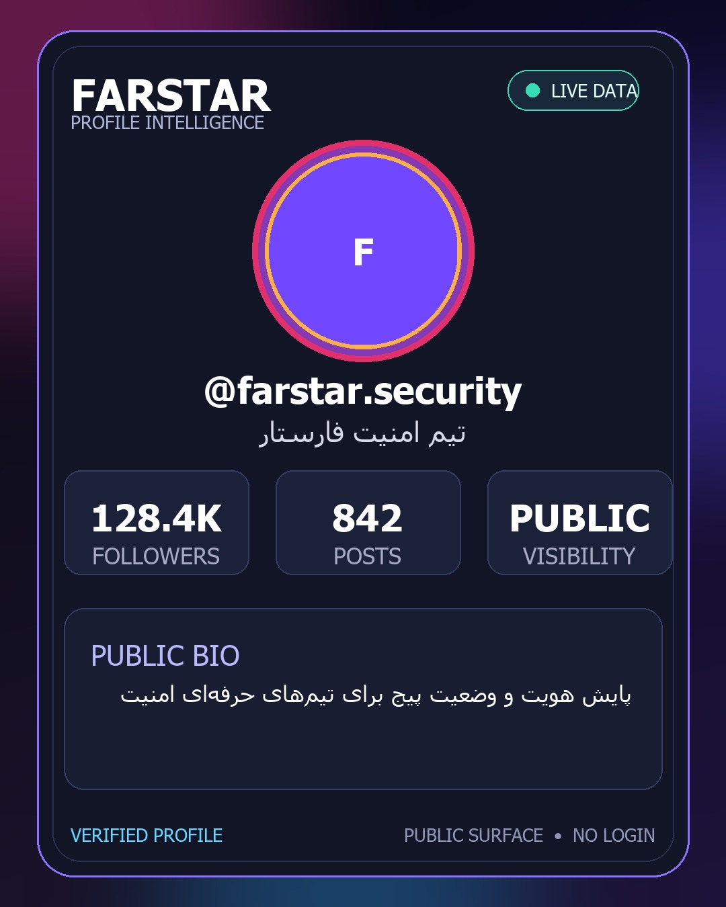
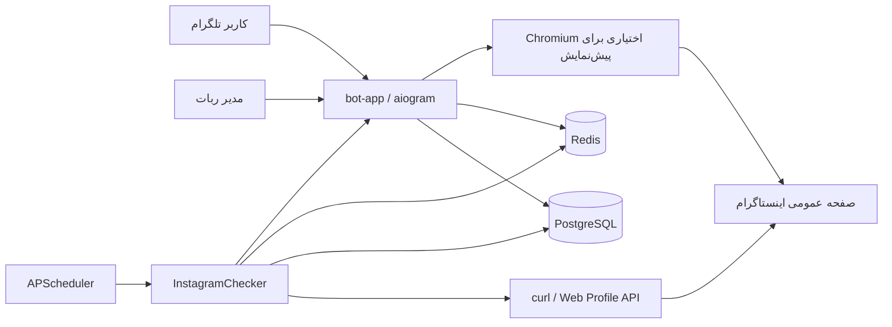

# Farstar Warner | فارستار وارنر

ربات تلگرام فارسی برای پایش وضعیت پیج‌های عمومی اینستاگرام، بدون دریافت رمز عبور کاربر یا نیاز به کلید رسمی API اینستاگرام.

[راهنمای فارسی](#راهنمای-فارسی) · [English guide](#english-guide)

---

## راهنمای فارسی

### معرفی پروژه

فارستار وارنر یک سامانه ناهمگام برای پایش پیج‌های عمومی اینستاگرام است. کاربران می‌توانند پیج‌های موردنظرشان را به ربات اضافه کنند و برای فعال‌شدن، دی‌اکتیوشدن یا تغییر نام کاربری آن‌ها اعلان بگیرند. تمام پیام‌ها، دکمه‌ها، هشدارها و منوهای ربات به زبان فارسی هستند.

این سامانه فقط اطلاعات عمومی را بررسی می‌کند و هیچ رمز عبور، کوکی حساب شخصی یا دسترسی رسمی اینستاگرام از کاربر دریافت نمی‌کند.



### امکانات

- رابط کاربری کاملاً فارسی با `aiogram 3`
- پایش وضعیت با اجرای ناهمگام `curl` و Web Profile API دقیقاً با هدرهای تست‌شده روی سرور
- تشخیص تغییر وضعیت فعال و دی‌اکتیو
- تنظیم جداگانه اعلان‌ها برای هر پیج
- نمایش زنده عکس پروفایل، تعداد دنبال‌کننده، پست‌ها و عمومی یا خصوصی‌بودن پیج
- نمایش بیوگرافی پیج عمومی در صورتی که نمای embed آن را ارائه کند
- ساخت کارت تصویری انگلیسی با طراحی شیشه‌ای هنگام ثبت پیج برای تأیید نام، عکس، آمار و بیوگرافی قابل‌دسترسی
- امکان ثبت نام کاربری غیرفعال برای کاربرانی که منتظر فعال‌شدن آن هستند
- پلن رایگان دائمی با ۱ پیج، Premium با ظرفیت پایه ۱۰۰ پیج و VIP با ظرفیت پایه ۵۰۰ پیج
- پلن‌های مدت‌دار قابل افزودن، ویرایش و حذف با نام، قیمت، تعداد روز و ظرفیت دلخواه مدیر
- عضویت اجباری در یک یا چند کانال قابل‌مدیریت از پنل مدیر
- پرداخت از طریق آیدی پشتیبانی یا کارت‌به‌کارت با فیش یکتا و تأیید یا رد دستی مدیر
- تشخیص و اعلان تغییر عکس پروفایل با fingerprint پایدار مسیر تصویر
- شناسایی خودکار مدیر اصلی با پلن ویژه، منوی اختصاصی و اعتبار مدیریتی
- پنل مدیریت برای افزودن پیج مدیر، مشاهده سلامت اتصال عمومی، آمار، تمدید اشتراک، تغییر فاصله و اجرای بررسی فوری
- مرکز امنیت هر پیج با ۱۰ ابزار: بررسی فوری، امتیاز هشدار، ممیزی عمومی، اثرانگشت هویت، خط مبنا، تاریخچه رخداد، گزارش حادثه، تست اعلان، سلامت پایش و تصویر شواهد
- PostgreSQL برای نگهداری کاربران، پیج‌ها و تنظیمات
- Redis برای وضعیت‌های موقت ربات، قفل توزیع‌شده و کنترل محدودیت درخواست
- زمان‌بندی بررسی‌ها با APScheduler
- تأخیر تصادفی، User-Agent چرخشی، هم‌روندی محدود و توقف خودکار هنگام دریافت خطای `429`
- اجرای ایمن در کانتینر بدون دسترسی ریشه، با فایل‌سیستم فقط‌خواندنی
- نصب تعاملی روی اوبونتو با یک اسکریپت انگلیسی
- پنل مدیریت انگلیسی سرور با فرمان `farstar` و پشتیبانی از چند ربات مستقل
- نسخه‌گذاری معنایی، فرمان `/version` و اعلان خودکار فارسی به مدیر پس از فعال‌شدن هر نسخه جدید
- نمایش پایدار اطلاعات پیج با کش آخرین پاسخ سالم، تک‌درخواستی و کنترل نرخ سراسری اینستاگرام
- تمدید تجمیعی اشتراک؛ مدت خرید جدید به تاریخ پایان فعلی اضافه می‌شود
- یادآوری روزانه در سه روز پایانی اشتراک با امکان قطع یا فعال‌کردن اعلان توسط کاربر
- کد تخفیف دارای درصد، سقف مصرف و تاریخ انقضا با کنترل نهایی هنگام تأیید فیش
- فروشگاه محصولات با افزودن/حذف محصول و کلید خاموش/روشن از پنل مدیر

### معماری



سه سرویس Docker Compose اجرا می‌شوند:

- `bot-app`: ربات تلگرام و چکر ناهمگام
- `postgres`: پایگاه داده دائمی
- `redis`: ذخیره وضعیت FSM، قفل اجرای چکر و زمان توقف پس از محدودیت درخواست

### پیش‌نیازها

- یک سرور Ubuntu با دسترسی `sudo` یا کاربر `root`
- توکن ربات از `@BotFather`
- شناسه عددی تلگرام مدیر
- دسترسی خروجی HTTPS به تلگرام، اینستاگرام و مخزن‌های Docker

در صورت نصب‌نبودن Docker و Docker Compose، اسکریپت نصب آن‌ها را از مخزن رسمی Docker دریافت می‌کند.

### نصب سریع روی اوبونتو

```bash
git clone https://github.com/farstar-team/farstar-warner.git
cd farstar-warner
chmod +x install.sh
./install.sh
```

نصب‌کننده موارد زیر را به زبان انگلیسی درخواست می‌کند:

1. توکن ربات تلگرام
2. شناسه عددی مدیر
3. نام پایگاه داده PostgreSQL
4. نام کاربری PostgreSQL
5. رمز PostgreSQL
6. رمز Redis؛ با خالی‌گذاشتن این مقدار یک رمز امن ساخته می‌شود

توکن تلگرام هنگام تایپ نمایش داده می‌شود تا بتوانید درستی آن را کنترل کنید؛ رمزهای PostgreSQL و Redis برای امنیت مخفی می‌مانند.

سپس فایل `.env` با سطح دسترسی محدود ساخته شده و دستور زیر خودکار اجرا می‌شود:

```bash
docker compose up --build -d
```

در پایان نصب، فرمان سراسری `farstar` نیز روی سرور فعال می‌شود.

### فعال‌کردن پنل سرور روی نصب قبلی

اگر نسخه قبلی ربات از قبل نصب است، ابتدا آخرین نسخه را دریافت و نصب‌کننده را دوباره اجرا کنید:

```bash
cd farstar-warner
git pull
chmod +x install.sh farstar.sh
./install.sh
```

نصب‌کننده فایل `.env` قبلی را تشخیص می‌دهد. برای حفظ توکن و اطلاعات فعلی، در پاسخ به پرسش استفاده مجدد از تنظیمات، Enter یا `y` را بزنید. پس از این مرحله فرمان زیر پنل را باز می‌کند:

```bash
farstar
```

### پنل مدیریت سرور با فرمان farstar

فرمان `farstar` یک منوی انگلیسی برای عملیات روزمره سرور باز می‌کند:

- افزودن و نصب ربات جدید با PostgreSQL و Redis مستقل
- فهرست‌کردن همه ربات‌ها و وضعیت اجرای آن‌ها
- شروع، توقف و راه‌اندازی مجدد هر ربات
- مشاهده زنده لاگ هر نمونه
- دریافت آخرین نسخه شاخه `main` از GitHub و بازسازی ربات‌های در حال اجرا
- ویرایش تنظیمات هر ربات
- پشتیبان‌گیری و بازیابی PostgreSQL
- حذف امن ربات با امکان نگه‌داشتن یا پاک‌کردن داده‌ها
- مشاهده نسخه Docker و مصرف منابع کانتینرها

فرمان‌های مستقیم نیز در دسترس هستند:

```bash
farstar list
farstar status warner
farstar logs warner
farstar apply warner
farstar update
farstar backup warner
farstar doctor
farstar version
farstar help
```

ربات اولیه با نام `warner` ثبت می‌شود. هر ربات جدید نام نمونه، توکن، مدیر، پایگاه داده، Redis، شبکه و volumeهای جداگانه دارد.

برای نصب ربات جدید:

```bash
farstar add
```

برای حذف یک ربات:

```bash
farstar remove NAME
```

حذف volumeها اختیاری است. اگر در پاسخ حذف داده‌ها `y` وارد کنید، اطلاعات PostgreSQL و Redis آن نمونه نیز پاک می‌شود.

### بررسی وضعیت اجرا

```bash
farstar status warner
farstar logs warner
```

برای خروج از نمایش زنده لاگ‌ها، کلیدهای `Ctrl+C` را فشار دهید. این کار سرویس ربات را متوقف نمی‌کند.

دستورهای مدیریتی متداول:

```bash
# راه‌اندازی مجدد ربات
farstar restart warner

# توقف همه سرویس‌ها بدون حذف داده‌ها
farstar stop warner

# اجرای دوباره سرویس‌ها
farstar start warner

# دریافت کد جدید و بازسازی برنامه
farstar update
```

برای حذف ربات از `farstar remove` استفاده کنید. مدیر سرور قبل از حذف volumeهای PostgreSQL و Redis تأیید جداگانه می‌گیرد.

### استفاده از ربات

پس از نصب، وارد گفت‌وگوی ربات شوید و دستور `/start` را ارسال کنید.

نسخه فعال در پیام شروع و فرمان `/version` نمایش داده می‌شود. نسخه فعلی **3.0.3** است. پس از اولین اجرای موفق هر نسخه جدید، مدیر اصلی یک اعلان فارسی شامل شماره نسخه و فهرست تغییرات دریافت می‌کند. آخرین نسخه‌ای که اعلان شده در Redis نگهداری می‌شود تا با هر restart پیام تکراری ارسال نشود.

منوی اصلی شامل این گزینه‌هاست:

- `مدیریت پیج‌ها 📊`: افزودن، مشاهده یا حذف پیج
- `خرید اشتراک 💎`: مشاهده پلن‌های فعال، ارتباط با پشتیبانی یا ارسال فیش کارت‌به‌کارت
- `تنظیمات اعلان‌ها ⚙️`: فعال یا غیرفعال‌کردن اعلان هر پیج
- `حساب کاربری 👤`: مشاهده پلن، اعتبار و تعداد پیج‌ها
- `پنل مدیریت 🛡️`: فقط برای مدیر اصلی نمایش داده می‌شود

نام کاربری اینستاگرام را می‌توان به یکی از شکل‌های زیر فرستاد:

```text
@instagram
instagram
https://www.instagram.com/instagram/
```

پس از انتخاب هر پیج، دکمه `مشاهده اطلاعات زنده پیج 🔎` در دسترس است. ربات در صورت دسترسی، عکس پروفایل، تعداد دنبال‌کننده، پست، عمومی یا خصوصی‌بودن، وضعیت تأیید و اطلاعات تکمیلی پیج عمومی را ارسال می‌کند.

از دکمه `مرکز امنیت و شواهد پیج` نیز می‌توان ۱۰ ابزار دفاعی و گزارش‌گیری را اجرا کرد. خط مبنای هویت در Redis ذخیره می‌شود و اثر فعلی نام، بیوگرافی، تصویر، نوع پیج و نشان تأیید را با آن مقایسه می‌کند.

هنگام افزودن پیج، ربات ابتدا Web Profile API اینستاگرام را بدون Session یا ورود بررسی می‌کند:

- اگر پیج فعال باشد، نام، بیوگرافی، تصویر، دنبال‌کننده، دنبال‌شونده، تعداد پست، نوع پیج و نشان تأیید مستقیماً از JSON استخراج می‌شود. ربات اطلاعات فارسی و کارت تصویری اختصاصی را برای تأیید می‌فرستد؛ شکست ساخت یا ارسال عکس مانع نمایش متن و دکمه تأیید نمی‌شود.
- اگر پاسخ `404` باشد، گزینه «ثبت به‌عنوان پیج غیرفعال» نمایش داده می‌شود. این پیج با وضعیت غیرفعال ذخیره می‌شود و به‌محض بازگشت پاسخ `200`، اعلان فعال‌شدن ارسال خواهد شد.
- در پاسخ نامشخص، redirect، محدودیت موقت یا خطای شبکه، کاربر می‌تواند پیج را فعال ثبت کند یا گزینه «فعلاً غیرفعال است» را برای انتظار فعال‌شدن انتخاب کند. نتیجه نامشخص خودکار وضعیت رکوردهای قبلی را تغییر نمی‌دهد.

### پنل مدیریت

مدیری که شناسه او در `ADMIN_TELEGRAM_ID` ثبت شده است می‌تواند دستور زیر را اجرا کند:

```text
/admin
```

امکانات پنل مدیریت:

- مشاهده تعداد کاربران و وضعیت پیج‌ها
- تمدید اشتراک کاربر و انتخاب پلن جدید
- افزودن، ویرایش و حذف پلن‌های مدت‌دار همراه قیمت و ظرفیت
- مدیریت کانال‌های عضویت اجباری
- تغییر آیدی پشتیبانی، شماره کارت و نام صاحب کارت
- مشاهده فیش‌های در انتظار و تأیید یا رد آن‌ها زیر همان تصویر
- تغییر فاصله بررسی چکر بین ۳۰ تا ۸۶۴۰۰ ثانیه
- قراردادن بررسی فوری همه پیج‌ها در صف اجرا
- افزودن پیج به حساب پایش مدیر با همان جریان تأیید تصویری کاربران
- مشاهده وضعیت Chromium، endpoint عمومی، cooldown و حالت ورود/عدم ورود

حساب مدیر اصلی هنگام شروع برنامه به‌صورت خودکار فعال، روی پلن ویژه و با منوی اختصاصی ثبت می‌شود.

فاصله جدید در Redis ذخیره می‌شود و پس از راه‌اندازی مجدد نیز باقی می‌ماند.

برای راه‌اندازی فروش اشتراک پس از نصب:

1. از «مدیریت پلن‌های اشتراک» حداقل یک پلن با نام، قیمت، روز و ظرفیت بسازید.
2. از «تنظیمات پرداخت» آیدی پشتیبانی و در صورت نیاز شماره کارت و نام صاحب کارت را ثبت کنید.
3. از «کانال‌های عضویت اجباری» کانال‌ها را اضافه کنید؛ ربات باید در هر کانال مدیر باشد تا بتواند عضویت کاربران را بررسی کند.
4. فیش‌های جدید به مدیر ارسال می‌شوند و از «فیش‌های در انتظار» نیز قابل بازیابی و بررسی هستند.

اشتراک فقط پس از انتخاب «تأیید فیش و فعال‌سازی» توسط مدیر فعال می‌شود. شناسه یکتای فایل تلگرام در دیتابیس ذخیره می‌شود تا همان فیش دوباره ثبت نشود.

### منطق پایش

چکر برای هر پیج همان درخواست curl تست‌شده را به Web Profile API اجرا می‌کند. curl داخل کانتینر نصب است و بدون shell، رمز، Session یا grep اجرا می‌شود:

- انتقال وضعیت از دی‌اکتیو به فعال، اعلان `پیج فعال شد! 🎉` ایجاد می‌کند.
- انتقال وضعیت از فعال به دی‌اکتیو پس از دو پاسخ قطعی متوالی، اعلان `پیج دی‌اکتیو شد! ⚠️` ایجاد می‌کند.
- تغییر مسیر پایدار عکس پروفایل اعلان `عکس پروفایل پیج تغییر کرد! 🖼️` ایجاد می‌کند؛ پارامترهای موقت CDN نادیده گرفته می‌شوند.
- اولین بررسی فقط وضعیت پایه را ثبت می‌کند و اعلان تغییر وضعیت نمی‌فرستد.
- پاسخ‌های ورود اجباری، چالش امنیتی، خطاهای شبکه و خطاهای موقت به‌عنوان وضعیت نامشخص در نظر گرفته می‌شوند و وضعیت ذخیره‌شده را تغییر نمی‌دهند.
- در پاسخ `429` همه بررسی‌ها برای مدت مشخصی متوقف می‌شوند تا فشار بیشتری به سرویس وارد نشود.

> [!IMPORTANT]
> اینستاگرام می‌تواند ساختار صفحات عمومی یا سیاست‌های دسترسی خود را بدون اطلاع قبلی تغییر دهد. پایش بدون API رسمی تضمین دائمی ندارد. فقط پیج‌های عمومی را بررسی کنید و قوانین محل فعالیت و شرایط استفاده سرویس‌ها را رعایت کنید.

### متغیرهای محیطی

اسکریپت نصب متغیرهای ضروری را در `.env` می‌سازد. این فایل در Git نادیده گرفته شده و نباید در مخزن ثبت شود.

| متغیر | الزامی | مقدار پیش‌فرض | توضیح |
|---|---:|---:|---|
| `TELEGRAM_BOT_TOKEN` | بله | — | توکن دریافتی از BotFather |
| `ADMIN_TELEGRAM_ID` | بله | — | شناسه عددی مدیر |
| `POSTGRES_DB` | بله | `farstar_warner` | نام پایگاه داده |
| `POSTGRES_USER` | بله | `farstar` | کاربر PostgreSQL |
| `POSTGRES_PASSWORD` | بله | — | رمز PostgreSQL |
| `POSTGRES_HOST` | خیر | `postgres` | نام میزبان پایگاه داده |
| `POSTGRES_PORT` | خیر | `5432` | پورت PostgreSQL |
| `DATABASE_POOL_SIZE` | خیر | `10` | اندازه پایه مخزن اتصال |
| `DATABASE_MAX_OVERFLOW` | خیر | `20` | اتصال‌های اضافه مجاز |
| `REDIS_HOST` | خیر | `redis` | نام میزبان Redis |
| `REDIS_PORT` | خیر | `6379` | پورت Redis |
| `REDIS_DB` | خیر | `0` | شماره دیتابیس Redis |
| `REDIS_PASSWORD` | بله | — | رمز Redis |
| `CHECK_INTERVAL_SECONDS` | خیر | `300` | فاصله اولیه بررسی‌ها؛ حداقل ۳۰ ثانیه |
| `CHECK_CONCURRENCY` | خیر | `8` | تعداد بررسی هم‌زمان؛ بین ۱ تا ۵۰ |
| `DEACTIVATION_CONFIRMATIONS` | خیر | `2` | تعداد پاسخ قطعی متوالی پیش از ثبت دی‌اکتیوشدن |
| `CHECK_JITTER_MIN_SECONDS` | خیر | `0.5` | کمترین تأخیر تصادفی |
| `CHECK_JITTER_MAX_SECONDS` | خیر | `3.0` | بیشترین تأخیر تصادفی |
| `INSTAGRAM_BASE_URL` | خیر | `https://www.instagram.com` | نشانی پایه صفحات عمومی |
| `INSTAGRAM_REQUEST_TIMEOUT_SECONDS` | خیر | `20` | مهلت هر درخواست HTTP |
| `RATE_LIMIT_COOLDOWN_SECONDS` | خیر | `900` | توقف پیش‌فرض پس از محدودیت درخواست |
| `CHROMIUM_EXECUTABLE` | خیر | `/usr/bin/chromium` | مسیر Chromium نصب‌شده از مخزن Debian |
| `PROFILE_PREVIEW_TIMEOUT_SECONDS` | خیر | `45` | مهلت رندر نمای عمومی پیج |
| `PROFILE_PREVIEW_CACHE_SECONDS` | خیر | `900` | مدت کش اطلاعات تصویری پیج |
| `PROFILE_PREVIEW_CONCURRENCY` | خیر | `2` | حداکثر رندر هم‌زمان Chromium |
| `FREE_TRIAL_DAYS` | خیر | `7` | اعتبار اولیه کاربر جدید |
| `LOG_LEVEL` | خیر | `INFO` | سطح ثبت رویدادها |

برای تغییر امن تنظیمات نمونه اصلی از پنل استفاده کنید؛ در پایان، پنل درباره بازسازی کانتینر سؤال می‌کند:

```bash
farstar edit warner
```

اگر فاصله بررسی قبلاً از پنل مدیریت تغییر کرده باشد، مقدار ذخیره‌شده در Redis بر `CHECK_INTERVAL_SECONDS` اولویت دارد. برای تغییر آن دوباره از گزینه زمان‌بندی در پنل مدیریت استفاده کنید.

### پشتیبان‌گیری از پایگاه داده

ساخت نسخه پشتیبان:

```bash
farstar backup warner
```

مسیر فایل ساخته‌شده در خروجی نمایش داده می‌شود. برای بازیابی نسخه پشتیبان در پایگاه داده موجود:

```bash
farstar restore warner
```

پیش از بازیابی، از وضعیت فعلی نسخه پشتیبان بگیرید؛ بازیابی می‌تواند اطلاعات موجود را تغییر دهد.

### عیب‌یابی

مشاهده صد خط آخر لاگ ربات:

```bash
docker compose logs --tail=100 bot-app
```

اگر ربات پاسخ نمی‌دهد:

1. با `docker compose ps` سالم‌بودن هر سه سرویس را بررسی کنید.
2. توکن و شناسه مدیر را در `.env` کنترل کنید.
3. خروجی `docker compose logs --tail=100 bot-app` را بررسی کنید.
4. مطمئن شوید سرور به `api.telegram.org` دسترسی دارد.

اگر بررسی اینستاگرام موقتاً انجام نمی‌شود، وجود خطای `429` یا پیام cooldown در لاگ طبیعی است؛ پس از پایان زمان توقف، چکر خودکار ادامه می‌دهد.

### ساختار پروژه

```text
farstar-warner/
├── install.sh
├── farstar.sh
├── docker-compose.yml
├── Dockerfile
├── requirements.txt
└── bot/
    ├── config.py
    ├── database.py
    ├── models.py
    ├── checker.py
    ├── profile_preview.py
    ├── version.py
    ├── main.py
    ├── handlers/
    │   ├── admin.py
    │   └── user.py
    └── keyboards/
        ├── inline.py
        └── reply.py
```

---

## English guide

Farstar Warner is an asynchronous Telegram bot for monitoring public Instagram profiles without collecting Instagram passwords or requiring official Instagram API credentials. The Telegram interface is entirely in Persian; the Ubuntu installer is in English.

### Main features

- Asynchronous Telegram UI with aiogram 3
- Asynchronous curl-based Web Profile API checks using the server-validated headers
- Activation, deactivation, and username-change notifications
- On-demand profile card with photo, follower count, post count, privacy, verification, and biography when exposed by the public embed
- Confirmation before saving active profiles and an explicit waiting-list path for inactive usernames
- Per-profile notification settings
- Permanent one-target Free access, 100-target Premium, and 500-target VIP defaults
- Administrator-managed duration plans with configurable name, price, days, and target capacity
- Mandatory membership checks for administrator-configured Telegram channels
- Support-contact and card-transfer checkout with duplicate-resistant receipts and manual approval
- Stable profile-picture change detection and richer incident snapshots
- Restricted administrator panel with admin target onboarding and public-access health diagnostics
- Ten defensive per-profile tools for identity baselines, audit evidence, history, risk scoring, test alerts, health, and incident reports
- Automatic primary-administrator provisioning with a dedicated menu
- PostgreSQL persistence and Redis coordination
- APScheduler background checks with jitter, bounded concurrency, distributed locking, and HTTP 429 cooldown
- Hardened, non-root Docker deployment
- An English `farstar` Ubuntu server manager for multiple isolated bot instances

### Ubuntu installation

Requirements: an Ubuntu server with root or sudo access, a Telegram bot token, and the numeric Telegram ID of the administrator.

```bash
git clone https://github.com/farstar-team/farstar-warner.git
cd farstar-warner
chmod +x install.sh
./install.sh
```

The installer checks Docker and the Docker Compose plugin, installs them when missing, prompts for application and database credentials, creates `.env`, installs the global `farstar` command, and starts all services. The Telegram token is visible while typing; database and Redis passwords remain hidden.

Check the deployment:

```bash
docker compose ps
docker compose logs -f bot-app
```

Update and rebuild:

```bash
farstar update
```

Run `farstar` without arguments to open the interactive manager. Use `farstar add` to install another isolated bot or `farstar help` to see all commands.

Open the bot and send `/start`. The configured administrator can access the restricted panel with `/admin`.

### Operational note

Instagram can change public page behavior or apply temporary access restrictions at any time. Login redirects, challenge pages, network errors, and temporary server failures are treated as unknown results and do not overwrite the last known profile state. Inconclusive HTTP results are verified through a rendered public page, and deactivation requires consecutive definitive responses. A `429` response activates a status-check-only Redis cooldown; profile previews use a separate cache and cannot pause monitoring.

Use the software only for public profiles and in accordance with applicable law and platform terms.
